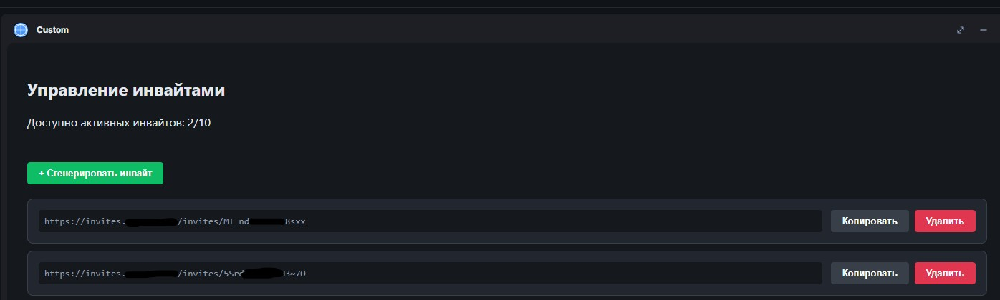

[English version](readme.md)

# Matrix Invite Manager Widget

Microservice and custom widget for Matrix Synapse that allows server users to independently create one-time invite links (registration tokens) for new members without administrator intervention.

## Main features

*   **Element Integration:** Works as a custom widget inside the Matrix client.
*   **Invite Management:** User-friendly interface for creating and deleting invite links.
*   **Limits:** Configurable limit on the number of active tokens per user.
*   **Security:** 
    *   User authentication via Matrix OpenID Connect (OIDC).
    *   Automatic Synapse admin token refresh.
    *   Public endpoint protection against brute-force attacks (Rate limiting and Tarpitting).
*   **Guest Page:** Landing page for invited users with token validity check and automatic transition to registration.
*   **Multilingual:** Full support for Russian and English (i18n). Automatic language application based on browser locale. You can easily add your own language using JSON files.
*   **Air-gapped installation capability** - By default, the widget uses a local copy of matrix-widget-api based on version 1.17.0. You can switch to the online version if necessary. 

## Screenshots



## Architecture

1.  **Backend (Go):** Interacts with the Synapse Admin API, manages the SQLite database, and checks access rights.
2.  **Private UI (HTML/JS):** Control panel for server members, opened inside a Matrix room.
3.  **Guest UI (HTML/JS):** Welcome page reached via a link like `https://domain.com/invites/{token}`.
4.  **Index UI (HTML):** Placeholder page for the microservice domain, *for protection against the curious =)*.

## Requirements

*   Installed Matrix Synapse with [registration tokens enabled](https://element-hq.github.io/synapse/latest/usage/configuration/config_documentation.html#registration_requires_token).
*   Synapse administrator account.
*   Installed Docker and Docker Compose.
*   Configured reverse proxy (Nginx, Caddy, etc.) for HTTPS.

## Configuration

The service is configured via environment variables:

| Variable | Description | Example usage | Required | Defaults |
| :--- | :--- | :--- | :--- | :--- |
| `SYNAPSE_URL` | URL of your synapse server | `https://matrix.domain.com` | ✅ | - |
| `SYNAPSE_ADMIN_USER` | Administrator username | `admin` | ✅ | - |
| `SYNAPSE_ADMIN_PASSWORD` | Administrator password | `your-password` | ✅ | - |
| `WEBCLIENT_URL` | URL of the Element web client (for redirection) | `https://chat.domain.com` | ✅ |
| `PORT` | Internal server (backend) port | `8080` | ❌ | `8080` |
| `PROXY_ADDR` | Proxy server IP/CIDR | `172.18.0.0/16` | ❌ | - |
| `INVITES_PER_USER` | Maximum number of active invites per user | `3` | ❌ | `5` |
| `WIDGET_API` | JS-API mode (`internal` или `external`) | `internal` | ❌ | `internal` | 
| `WIDGET_API_URL` | URL for connecting external JS-API. Used only when `WIDGET_API = external`   | `https://esm.sh/matrix-widget-api@latest` | ❌ | `https://esm.sh/matrix-widget-api@1.17.0` |  
| `NO_TLS` | **Not recommended** Disables HTTPS check. Use `I_KNOW_WHAT_I_DO` to enable   | - | ❌ | - |

## Installation and Launch

### Docker

0. *We strongly recommend creating a separate administrator user for this microservice.*

1. Copy the repository contents to your server. (here i use ./plugins/invitemgr dirrectory for example)
2. It is highly recommended to run the service in a Docker container behind a proxy (ex., Caddy):

```Caddyfile
# Invite service
invites.domain.org {
    reverse_proxy invitemgr:8080
}
```

3. Configure your docker-compose file.:
```docker-compose.yaml
services:
  invitebot:
    build: ./plugins/invitemgr
    restart: unless-stopped
    environment:
      - SYNAPSE_URL=https://matrix.domain.org
      - SYNAPSE_ADMIN_USER=admin_bot_user
      - SYNAPSE_ADMIN_PASSWORD=VERY_STRONG_PASSWORD
      - WEBCLIENT_URL=https://chat.domain.org
      - PROXY_ADDR=172.18.0.0/16 #Docker subnet
      - WIDGET_API=internal
      - INVITES_PER_USER=10
    volumes:
      - ./plugins/invitemgr/db:/app/data
      - ./plugins/invitemgr/libs:/app/libs
    networks:
      - your-matrix-network
```

4. Build and start the image:
```bash
docker compose build invitemgr
docker compose up -d invitemgr
```
5. Check logs for errors and adjust the config if necessary.
```bash
docker compose logs invitemgr
```

## Usage

1. Go to the room inside your Element where you want to place the widget.
2. Enter the command to connect the widget inside the room:
```
/addwidget https://invites.domain.org
```
3. Allow the widget to access your data (OpenID). *ЭThis must be done by every user who wants to work with the widget or invite others*.
    3.1. Verification - generate an invite.
    3.2. Go to your Synapse admin panel and check the Registration Tokens section to ensure the token was actually created and matches the generated invite.
    3.3. Follow the generated link and try to complete registration.
4. If necessary, pin the widget in the room template.

**Now any user with access to the configured room can create invites and invite other users.**

## Planned Improvements (TODO List)

1. Ability to set token expiration time.
2. Ability to set the number of registrations per token.
3. Mini admin panel - ability for room administrators to manage user tokens.
4. Ability to set minimum account age for creation invites.